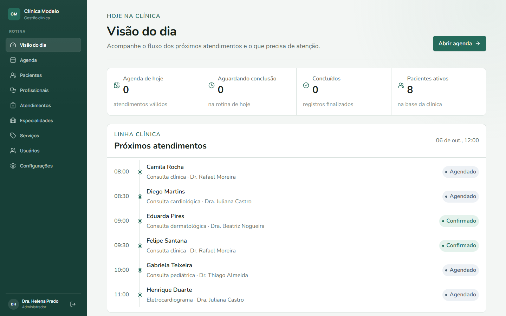
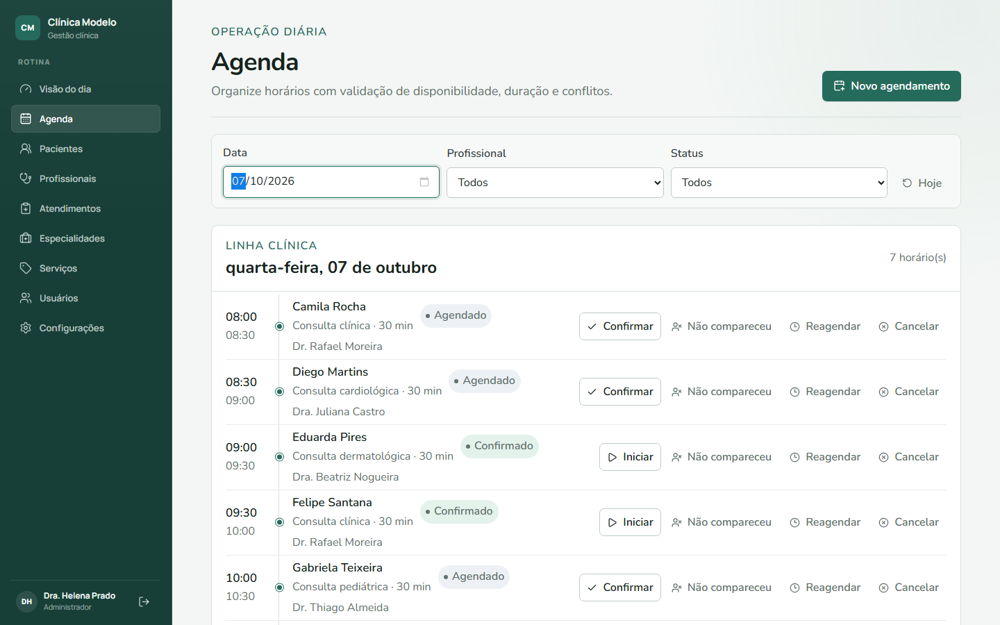
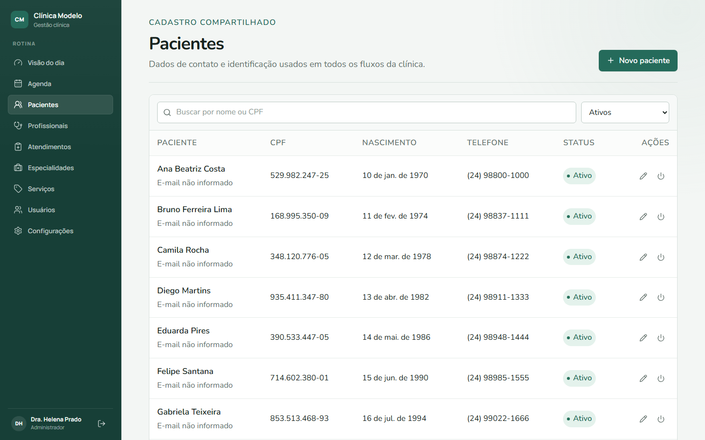
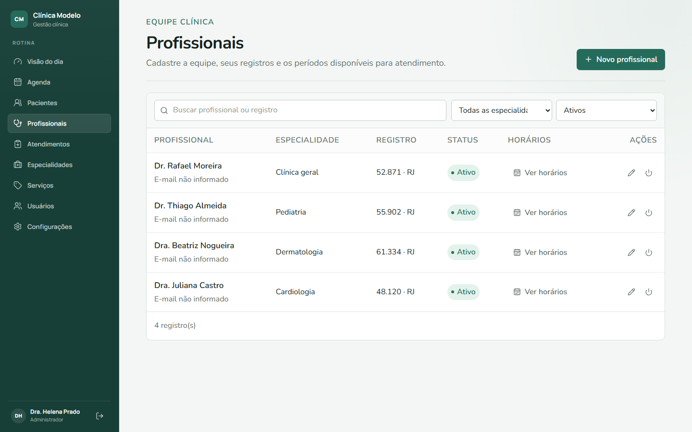
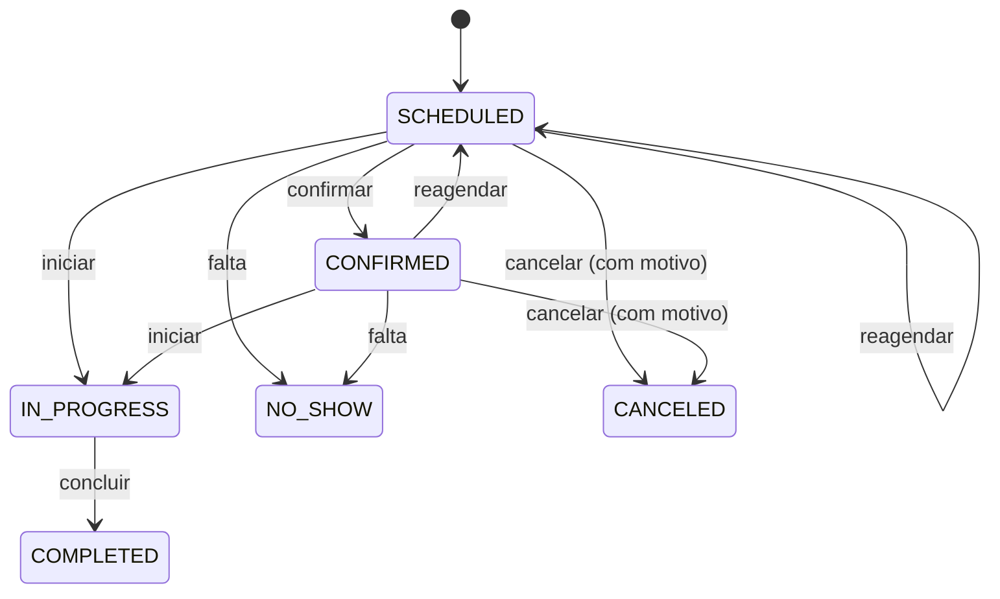

# Escritório Médico Base

**Sistema de gestão para clínicas e consultórios:** agenda com validação de disponibilidade e conflitos, pacientes, profissionais, serviços e atendimentos, com três perfis de acesso controlados no servidor.

[](https://github.com/Tutzdev/EscritorioMedicoBase/actions/workflows/ci.yml)




## Por que este projeto

Clínicas de especialidades diferentes compartilham a mesma rotina: cadastrar paciente, montar a agenda dos profissionais, confirmar, atender e registrar. Este projeto é um **núcleo reutilizável** dessa rotina. Necessidades de uma especialidade (exames, laudos, imagens) entram como **módulos próprios**, sem encher as entidades compartilhadas de campos opcionais.



## Funcionalidades

- **Autenticação JWT** com access token (15 min) e refresh token (7 dias).
- **Três perfis** (administrador, recepção e profissional), com permissões aplicadas na API via `@PreAuthorize`.
- **Agenda** com duração calculada pelo serviço, bloqueio de conflito de horário e de agendamento fora da disponibilidade do profissional.
- **Fluxo de status** do atendimento: confirmar, iniciar, concluir, falta, reagendar e cancelar com motivo.
- **Pacientes** com validação de CPF (dígitos verificadores), ativação e inativação.
- **Profissionais** com registro (CRM/UF), especialidade e disponibilidade semanal.
- **Painel do dia** com métricas e próximos horários.
- **Identidade da clínica** configurável: nome, dados institucionais, fuso horário, cor e logotipo.

| Pacientes | Profissionais | Login |
| --- | --- | --- |
|  |  |  |

## Regras de negócio que valem destacar

### Ciclo de vida do agendamento

As transições ficam **dentro da entidade** (`appointment.confirm()`, `appointment.cancel(motivo)`...). Uma transição inválida, como concluir um atendimento que nem começou, gera erro **422** em vez de corromper o estado.



### Permissões

| Recurso | Administrador | Recepção | Profissional |
| --- | --- | --- | --- |
| Usuários, especialidades, serviços e configurações | Gerencia | — | — |
| Profissionais e disponibilidade | Gerencia | Consulta | Consulta |
| Pacientes | Gerencia | Gerencia | Consulta |
| Agenda | Gerencia | Gerencia | Consulta e atualiza o fluxo |
| Atendimentos | Registra | Consulta | Registra |

Ocultar um botão no frontend não substitui autorização: **toda regra acima é testada contra a API** (veja [Testes](#testes)).

## Arquitetura

Organização **por domínio**. Cada pacote tem `controller`, `service`, `repository`, `entity`, `dto`, `mapper` e `exception` próprios.

```mermaid
flowchart LR
    W[React SPA] -->|/api + Bearer| SEC[Spring Security<br/>JwtAuthenticationFilter]
    SEC --> CT[Controllers<br/>@PreAuthorize]
    CT --> SV[Services<br/>regras e transações]
    SV --> EN[Entidades<br/>invariantes e transições]
    SV --> RP[Repositories<br/>Specifications]
    RP --> DB[(PostgreSQL)]
    FW[Flyway] --> DB
```

```text
src/main/java/.../
├── appointment/     # agenda, conflitos e transições de status
├── auth/            # login, refresh, JWT e filtro de segurança
├── availability/    # períodos semanais por profissional
├── clinic/          # identidade da instalação
├── consultation/    # registro básico do atendimento
├── dashboard/       # visão operacional do dia
├── patient/  professional/  servicecatalog/  specialty/  user/
└── shared/          # erros padronizados, paginação, validação de CPF, health

frontend/src/
├── api/  auth/  app/        # cliente HTTP com renovação de token, rotas protegidas
├── components/  pages/      # telas e componentes (Radix Dialog, Lucide)
└── hooks/  types/  utils/
```

## Decisões técnicas

| Decisão | Por quê |
| --- | --- |
| JWT HMAC-256 implementado com `javax.crypto` | Sem dependência extra. A assinatura é comparada em tempo constante (`MessageDigest.isEqual`) e o algoritmo do header é ignorado, o que evita ataques de troca de algoritmo. Tokens de acesso e de renovação têm `type` distinto. |
| `ddl-auto=validate` + Flyway | O schema só muda por migração versionada, e o Hibernate apenas confere. |
| Lock pessimista ao alterar agendamento | Duas recepcionistas mexendo no mesmo horário não geram estado inconsistente. |
| Specifications nas listagens | Filtros combináveis (busca, status, perfil) sem uma query por combinação. |
| Erros no mesmo formato (`ApiErrorResponse`) | 400 com erros por campo, 401, 403, 404, 409 e 422 previsíveis para o frontend. Stack trace nunca vaza. |
| Bootstrap de administrador opt-in | O primeiro admin só é criado com `BOOTSTRAP_ADMIN_ENABLED=true` e senha de 12+ caracteres. Nada de credencial padrão. |
| TanStack Query no frontend | Cache, revalidação e estados de carregamento e erro consistentes em todas as telas. |

## Como rodar

Pré-requisitos: **JDK 21**, **PostgreSQL** e **Node.js 22+**.

```sql
CREATE DATABASE medical_office;
```

Configure as variáveis a partir do [`.env.example`](.env.example):

```bash
export DB_URL=jdbc:postgresql://localhost:5432/medical_office
export DB_USERNAME=medical_user
export DB_PASSWORD=sua_senha
export JWT_SECRET=$(openssl rand -base64 48)

# só na primeira subida, para criar o administrador
export BOOTSTRAP_ADMIN_ENABLED=true
export BOOTSTRAP_ADMIN_NAME="Administrador"
export BOOTSTRAP_ADMIN_EMAIL=admin@clinica.local
export BOOTSTRAP_ADMIN_PASSWORD=uma-senha-forte-de-12+
```

```bash
./mvnw spring-boot:run          # API em http://localhost:8080

cd frontend
npm install
npm run dev                     # Web em http://localhost:5173 (proxy de /api para a 8080)
```

Depois do primeiro acesso, desligue `BOOTSTRAP_ADMIN_ENABLED`.

## Testes

```bash
./mvnw test                     # backend (H2 em modo PostgreSQL, com as migrações Flyway)
cd frontend && npm run lint && npm run build
```

| Suíte | O que garante |
| --- | --- |
| `AuthorizationIntegrationTest` | Login, emissão de tokens, 401 sem token e a **matriz de permissões** (recepção cadastra paciente, profissional não; recepção não gerencia usuários), CPF inválido e JSON malformado |
| `AppointmentServiceTest` / `AppointmentTest` | Conflito de horário, agendamento fora da disponibilidade e transições de status válidas e inválidas |
| `ProfessionalAvailabilityServiceTest` | Sobreposição de períodos de disponibilidade |
| `JwtServiceTest` | Emissão e leitura do token, refresh token recusado como access token e token malformado |
| `CpfValidatorTest` | Dígitos verificadores e sequências repetidas |
| `MedicalOfficeApiApplicationTests` | Subida do contexto com todas as migrações aplicadas |

O **GitHub Actions** roda backend e frontend a cada push.

## Segurança e dados

- Nenhum segredo no repositório: banco, JWT e administrador vêm do ambiente.
- Senhas com **BCrypt**, segredo JWT de no mínimo 32 bytes (a aplicação não sobe com menos).
- CORS restrito a `CORS_ALLOWED_ORIGINS`.
- Os dados das capturas de tela são **fictícios**.

## Próximos passos

- Testcontainers com PostgreSQL real nos testes de integração.
- Refresh token em cookie `HttpOnly` em vez de `localStorage`.
- Primeiro módulo de especialidade (ex.: fonoaudiologia) sobre os contratos do núcleo.
- Dockerfile e `docker compose` com API, web e banco.

---

Desenvolvido por **[Tutzdev](https://github.com/Tutzdev)**.
